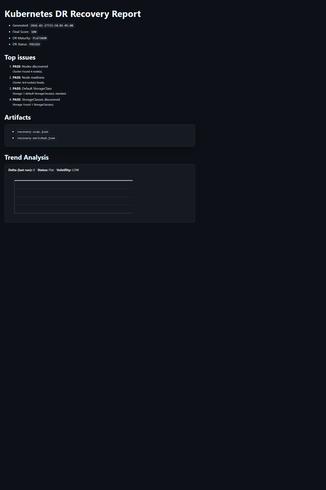

# k8s-recovery-visualizer

Kubernetes Disaster Recovery scoring and readiness assessment tool.

Designed to analyze live Kubernetes environments and generate a structured DR maturity score before cluster rebuild or replication planning.

---

## Why This Exists

Building DR clusters without structured discovery leads to:
- Incorrect storage class mapping
- Missing workload dependencies
- Unprotected stateful workloads
- False assumptions about restore viability

k8s-recovery-visualizer performs deterministic environment analysis and produces:
- Inventory data (JSON)
- Enriched DR metadata
- Human-readable HTML report
- Historical trend tracking
- DR maturity scoring

---

## What It Generates

Output directory: .\out\

- recovery-scan.json (raw cluster inventory)
- recovery-enriched.json (DR analysis)
- recovery-report.md (markdown report)
- recovery-report.html (dark-mode HTML report)
- history\index.json (trend tracking)

---

## DR Scoring Model

Score categories include:
- Storage configuration
- Stateful workload detection
- Namespace structure
- Cluster topology
- Expandability / recovery risk

Final Score Output:
- PLATINUM
- GOLD
- SILVER
- BRONZE

Trend tracking compares current run to previous scans.

---

## Quick Start

### 1. Run Cluster Scan

    .\scan.exe -out (Resolve-Path .\out).Path

This refreshes:
- recovery-scan.json
- recovery-enriched.json

---

### 2. Run Report Pipeline

    $repoRoot = (Resolve-Path ".").Path
    $outDir   = (Resolve-Path ".\out").Path

    pwsh -NoProfile -ExecutionPolicy Bypass -Command @"
    . `"$repoRoot\scripts\report\Bootstrap-ReportLib.ps1`"
    & `"$repoRoot\scripts\report\Append-Trend-To-Reports.ps1`" -OutDir `"$outDir`" -Window 10
    & `"$repoRoot\scripts\report\Normalize-ReportHtml.ps1`" -OutDir `"$outDir`"
    & `"$repoRoot\scripts\report\Apply-DarkTheme.ps1`" -OutDir `"$outDir`"
    "@

---

### 3. Open Report

    Start-Process .\out\recovery-report.html

---

## Important

The report pipeline does NOT scan Kubernetes.
Always run scan.exe first for fresh data.

To verify freshness:

    Get-ChildItem .\out\recovery-scan.json, .\out\recovery-enriched.json, .\out\recovery-report.html |
      Select-Object Name, LastWriteTime, Length | Format-Table -AutoSize

---

---

## Example Report

The HTML report is normalized, dark-mode optimized, and idempotent across multiple pipeline executions.

## Use Cases

- Pre-migration DR assessment
- Customer environment intake validation
- DRaaS readiness scoring
- Kubernetes risk profiling
- Repeatable DR maturity measurement

---

## Design Principles

- Idempotent execution
- Stable HTML normalization
- Deterministic scoring
- Dark-mode consistent rendering
- Repeatable historical trend tracking

---

## Future Enhancements

- Multi-cluster comparison
- Exportable executive summary
- Storage-class DR mapping validation
- Restore simulation scoring
- Customer-safe redacted export mode
