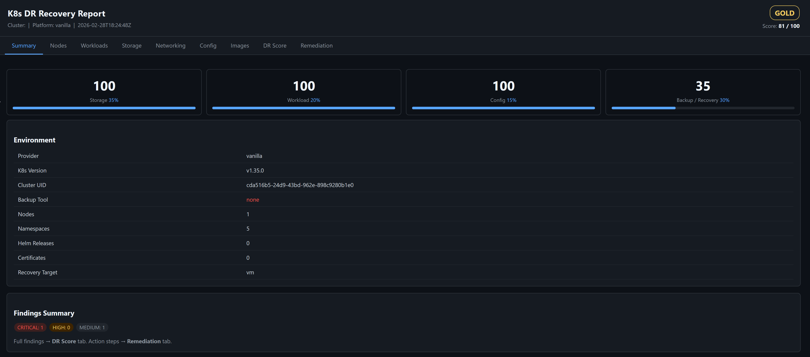
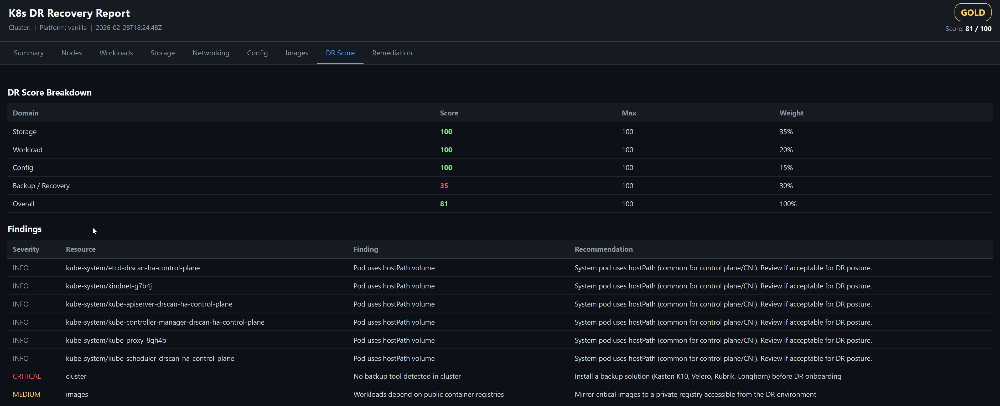

# k8s-recovery-visualizer

Full Kubernetes cluster inventory and Disaster Recovery assessment tool.

Scan a live cluster to get a complete RVTools-style inventory, a weighted DR readiness score across four domains, backup tool detection, backup policy analysis, restore simulation, and a prioritized remediation plan — all in a single self-contained HTML report.

---

## Why This Exists

Building DR clusters without structured discovery leads to:
- Missing stateful workloads with no backup coverage
- Storage classes that don't exist in the target environment
- Orphaned PVs with Delete reclaim policies that vanish on PVC deletion
- Public registry images that aren't reachable in air-gapped DR sites
- Backup tools installed but no policies or schedules configured
- No offsite target — a site-level failure takes the backups with it

k8s-recovery-visualizer performs deterministic environment analysis and produces a full picture of DR readiness before a rebuild or recovery event.

---

## What It Collects

| Category | Resources |
|----------|-----------|
| **Cluster** | Nodes (with zone), namespaces (with PSA labels), platform/provider, K8s version |
| **Workloads** | Deployments, DaemonSets, StatefulSets, Jobs, CronJobs |
| **Storage** | PVCs, PVs, StorageClasses, VolumeSnapshotClasses, VolumeSnapshots |
| **Networking** | Services, Ingresses, NetworkPolicies |
| **Config** | ConfigMaps, Secrets (metadata only), ClusterRoles, ClusterRoleBindings, CRDs, ResourceQuotas, LimitRanges, HPAs, PodDisruptionBudgets |
| **Security** | ServiceAccounts (with automount token flag), RBAC escalation audit |
| **Images** | All container images grouped by registry; public vs. private flag |
| **Helm** | All Helm v3 releases detected via K8s secrets (no Helm CLI required) |
| **Certificates** | cert-manager Certificate resources with expiry and days-to-renewal |
| **Backup** | Auto-detects 7 tools; collects Velero Schedules, Kasten K10 Policies, Longhorn RecurringJobs; etcd backup evidence |

---

## DR Scoring Model

Scoring covers four weighted domains:

| Domain | Weight | What It Measures |
|--------|--------|-----------------|
| **Storage** | 35% | PVC binding, storageClass presence, hostPath usage, reclaim policies |
| **Workload** | 20% | StatefulSet persistence, deployment coverage |
| **Config** | 15% | CRD backup readiness, certificate expiry, image registry risk, RBAC privilege audit |
| **Backup/Recovery** | 30% | Tool presence, policy coverage, offsite config, RPO, restore simulation |

**Maturity levels:** PLATINUM (≥90) · GOLD (≥75) · SILVER (≥50) · BRONZE (<50)

### Scoring Profiles

Use `--profile` to shift penalty emphasis without changing the base domain weights. Each profile multiplies specific penalty constants to reflect what matters most for that environment:

| Profile | Use Case | Elevated | Relaxed |
|---------|----------|----------|---------|
| `standard` | General-purpose assessment | — (baseline) | — |
| `enterprise` | Production SLA / regulated workloads | Restore testing (1.5×), Immutability (1.3×), Replication (1.2×), Security (1.2×) | — |
| `dev` | Development / staging clusters | — | Restore testing (0.9×), Immutability (0.9×) |
| `airgap` | Air-gapped or disconnected DR sites | Immutability (1.6×), Airgap restrictions (1.6×), Security (1.3×), Restore testing (1.2×) | — |

Profile multipliers apply to the following scoring rules:

| Profile Key | Scaling Applied To |
|-------------|-------------------|
| `restoreTesting` | `RESTORE_SIM_UNCOVERED`, `BACKUP_NO_POLICIES` |
| `immutability` | `PV_HOSTPATH`, `PV_DELETE_POLICY` |
| `replication` | `BACKUP_NO_OFFSITE` |
| `security` | `CERT_EXPIRING_SOON`, `RBAC_WILDCARD_VERB`, `RBAC_ESCALATE_PRIV`, `RBAC_SECRET_ACCESS` |
| `airgap` | `IMAGE_EXTERNAL_REGISTRY` |

The active profile and its multipliers are shown in the **DR Score** tab of the HTML report.

### Storage Domain Scoring Rules

| Finding ID | Severity | Penalty | Condition |
|---|---|---|---|
| `PVC_UNBOUND` | HIGH | −15 | PVC stuck in Pending state |
| `PV_HOST_PATH` | HIGH | −20 | PersistentVolume uses hostPath (not portable across nodes) |
| `PV_DELETE_POLICY` | HIGH | −15 | PersistentVolume has ReclaimPolicy=Delete |
| `PV_ORPHAN` | MEDIUM | −10 | PersistentVolume is released but not reclaimed |
| `STS_NO_PVC` | MEDIUM | −10 | StatefulSet has no PersistentVolumeClaim templates |
| `SNAPSHOT_NO_CLASS` | MEDIUM | −10 | No VolumeSnapshotClass present in cluster |
| `SNAPSHOT_PVC_UNCOVERED` | MEDIUM | −8 | PVCs with no corresponding VolumeSnapshot |
| `SC_RECLAIM_DELETE` | MEDIUM | −10 | StorageClass has ReclaimPolicy=Delete |
| `SC_HOSTPATH_PROVISIONER` | HIGH | −20 | StorageClass uses a hostPath provisioner |
| `SC_ZONE_UNAWARE` | MEDIUM | −8 | Multi-zone cluster has StorageClass not using WaitForFirstConsumer |

`PV_HOST_PATH` and `PV_DELETE_POLICY` are scaled by the `immutability` profile multiplier.

### Workload Domain Scoring Rules

| Finding ID | Severity | Penalty | Condition |
|---|---|---|---|
| `POD_PRIVILEGED` | HIGH | −15 | Pod runs with `privileged: true` security context |
| `POD_HOST_NAMESPACE` | MEDIUM | −10 | Pod uses hostPID, hostIPC, or hostNetwork |
| `NODE_NOT_READY` | HIGH | −20 | One or more nodes in NotReady state |
| `SINGLE_AZ_CLUSTER` | MEDIUM | −15 | Multi-node cluster with all nodes in a single availability zone |

### Config Domain Scoring Rules

| Finding ID | Severity | Penalty | Condition |
|---|---|---|---|
| `RBAC_WILDCARD_VERB` | CRITICAL | −20 | Custom ClusterRole grants wildcard verb permissions |
| `RBAC_ESCALATE_PRIV` | HIGH | −10 | Custom ClusterRole grants escalate, bind, or impersonate verbs |
| `RBAC_SECRET_ACCESS` | HIGH | −10 | Custom ClusterRole grants broad read access to Secrets |
| `CERT_EXPIRING_SOON` | HIGH | −15 | cert-manager Certificate expires within 30 days |
| `IMAGE_EXTERNAL_REGISTRY` | MEDIUM | −10 | Container images pulled from public registries |
| `HELM_UNTRACKED_RESOURCES` | LOW | −5 | Helm releases with resources not tracked in the release secret |
| `LR_MISSING_NAMESPACE` | MEDIUM | −8 | Namespace with workloads has no LimitRange defined |
| `PSA_MISSING_ENFORCE_LABEL` | MEDIUM | −10 | Namespace missing `pod-security.kubernetes.io/enforce` label |
| `ETCD_BACKUP_MISSING` | HIGH | −20 | No evidence of etcd backup (self-managed clusters only) |
| `NETPOL_MISSING_NAMESPACE` | MEDIUM | −12 | Namespace with running pods has no NetworkPolicy |
| `SA_DEFAULT_OVERPRIV` | HIGH | −15 | Default ServiceAccount has ClusterRoleBinding granting broad access |
| `SA_AUTOMOUNT_TOKEN` | MEDIUM | −10 | Pod has automountServiceAccountToken=true without a service account need |

RBAC rules are scaled by the `security` profile multiplier. `IMAGE_EXTERNAL_REGISTRY` is scaled by the `airgap` multiplier.

### Backup/Recovery Scoring Rules

| Finding ID | Severity | Penalty | Condition |
|---|---|---|---|
| `BACKUP_NONE` | CRITICAL | −60 | No backup tool detected |
| `BACKUP_NO_POLICIES` | HIGH | −30 | Tool detected but no schedules/policies found |
| `BACKUP_PARTIAL` | HIGH | −20 | StatefulSets in namespaces not covered by any policy |
| `BACKUP_NO_OFFSITE` | HIGH | −15 | No offsite or export location configured |
| `RESTORE_SIM_UNCOVERED` | HIGH | −20 | Stateful namespaces have no matching backup policy |
| `CRD_BACKUP_MISSING` | MEDIUM | −10 | Custom CRDs present but no backup tool to capture them |

`RESTORE_SIM_UNCOVERED` and `BACKUP_NO_POLICIES` are scaled by the `restoreTesting` multiplier. `BACKUP_NO_OFFSITE` is scaled by the `replication` multiplier.

### Example Scoring Breakdown

| Domain | Score | Weight | Weighted |
|--------|-------|--------|---------|
| Storage | 85/100 | 35% | 29.75 |
| Workload | 100/100 | 20% | 20.00 |
| Config | 90/100 | 15% | 13.50 |
| Backup/Recovery | 40/100 | 30% | 12.00 |
| **Overall** | **75/100** | — | **GOLD** |

---

## What It Generates

```
out/
├── recovery-scan.json          # Full cluster inventory + scores + findings
├── recovery-enriched.json      # Enriched DR analysis with trend + risk
├── recovery-report.md          # Markdown summary
├── recovery-runbook.html       # (--runbook) Customer-facing DR runbook, print-ready
├── recovery-report.html        # Self-contained dark-mode tabbed HTML report
├── history/
│   └── index.json              # Trend history across scans
└── csv/                        # (--csv flag) one file per inventory tab
    ├── nodes.csv
    ├── workloads.csv
    ├── storage.csv
    ├── networking.csv
    ├── config.csv
    ├── images.csv
    ├── helm.csv
    ├── certificates.csv
    ├── dr-score.csv
    └── remediation.csv
```

The HTML report is fully self-contained (no CDN, no external dependencies) — safe to open offline in customer environments.

---

## Report Tabs

| Tab | Content |
|-----|---------|
| **Summary** | Score card, maturity badge, platform, backup tool status, findings severity chart |
| **Nodes** | Node name, roles, OS image, kernel, container runtime, ready status, zone, taints |
| **Workloads** | All workload types (Deployments, StatefulSets, DaemonSets, Jobs, CronJobs) |
| **Storage** | PVCs + PVs + StorageClasses with binding status, backend, reclaim policy |
| **Networking** | Services, Ingresses with TLS status, NetworkPolicies |
| **Config** | ConfigMaps, Secrets, CRDs, ClusterRoles, Helm releases, Certificates |
| **Images** | Container images grouped by registry; public vs. private |
| **Backup** | Detected tools, backup policies with RPO + offsite flag, restore simulation per namespace |
| **DR Score** | 4-domain scoring breakdown with weighted domain scores and profile multipliers |
| **Findings** | All findings filterable by severity, with deep-links to remediation steps |
| **Remediation** | Prioritized, tool-specific remediation steps with commands |
| **Compare** | Scan-to-scan diff (only shown when `--compare` is used) |

---

## Quick Start

### Prerequisites

- Go 1.25+ **or** a pre-built binary from [Releases](../../releases)
- A valid `kubeconfig` with read access to the cluster

### Build

**Linux / macOS**
```bash
make build
# binary: dist/scan-linux-amd64  (or dist/scan-darwin-arm64 on Apple Silicon)
```

**One-liner without make**
```bash
GOOS=linux GOARCH=amd64 go build -o dist/scan-linux-amd64 ./cmd/scan
```

**Windows**
```powershell
$env:GOOS="windows"; $env:GOARCH="amd64"; go build -o dist\scan.exe .\cmd\scan
```

### Run

**Linux / macOS**
```bash
# Basic scan (VM recovery target)
./dist/scan-linux-amd64 --out ./out

# Scoped to specific namespaces
./dist/scan-linux-amd64 --namespace=prod,staging --out ./out

# Bare metal recovery target with CSV export
./dist/scan-linux-amd64 --target=baremetal --csv --out ./out

# Diff against a previous scan
./dist/scan-linux-amd64 --compare=./previous/recovery-scan.json --out ./out

# CI mode (exit code 2 if score below threshold)
./dist/scan-linux-amd64 --ci --min-score=75 --out ./out

# Enterprise profile — elevated weight on restore testing and immutability
./dist/scan-linux-amd64 --profile=enterprise --out ./out

# Airgap profile — elevated weight on image registry isolation and immutability
./dist/scan-linux-amd64 --profile=airgap --out ./out

# Self-signed / RKE2 / k3s clusters — skip TLS certificate verification
./dist/scan-linux-amd64 --insecure --out ./out

# Write a customer-facing DR runbook (print-ready HTML)
./dist/scan-linux-amd64 --runbook --out ./out

# Write a redacted JSON copy (no secret values)
./dist/scan-linux-amd64 --redact --out ./out

# Dry run (no cluster required)
./dist/scan-linux-amd64 --dry-run --out ./out
```

**Windows**
```powershell
.\dist\scan.exe --out .\out
.\dist\scan.exe --namespace=prod,staging --out .\out
.\dist\scan.exe --insecure --out .\out
.\dist\scan.exe --compare=.\previous\recovery-scan.json --out .\out
.\dist\scan.exe --redact --out .\out
.\dist\scan.exe --ci --min-score=75 --out .\out
```

### Open Report

```bash
# Linux
xdg-open ./out/recovery-report.html

# macOS
open ./out/recovery-report.html

# Windows
start .\out\recovery-report.html
```

---

## CLI Flags

| Flag | Default | Description |
|------|---------|-------------|
| `--kubeconfig` | `""` | Path to kubeconfig (uses in-cluster config if empty) |
| `--insecure` | `false` | Skip TLS certificate verification (use for self-signed certs, e.g. RKE2/k3s) |
| `--out` | `./out` | Output directory |
| `--target` | `vm` | Recovery target: `baremetal` or `vm` |
| `--profile` | `standard` | Scoring profile: `standard`, `enterprise`, `dev`, or `airgap` |
| `--runbook` | `false` | Write a customer-facing DR runbook HTML (`recovery-runbook.html`) |
| `--namespace` | `""` | Comma-separated namespaces to scan (empty = all namespaces) |
| `--compare` | `""` | Path to a previous `recovery-scan.json` to diff against |
| `--csv` | `false` | Write CSV exports to `out/csv/` |
| `--summary` | `false` | Print a one-line summary to stdout on completion |
| `--redact` | `false` | Write a redacted JSON copy with secret values removed |
| `--dry-run` | `false` | Run without a cluster (for testing) |
| `--ci` | `false` | CI mode: emit JSON summary + exit code 2 on failure |
| `--min-score` | `90` | Minimum acceptable overall score for CI pass |
| `--timeout` | `60` | Kubernetes API timeout in seconds |
| `--customer` | `""` | Customer identifier embedded in report metadata |
| `--site` | `""` | Site/region name embedded in report metadata |
| `--cluster` | `""` | Cluster name embedded in report metadata |
| `--env` | `""` | Environment tag (prod/dev/test) embedded in report metadata |

---

## Backup Tool Detection & Policy Analysis

The tool automatically detects these backup solutions and — for supported tools — collects detailed policy data:

| Tool | Detection | Policy Collection |
|------|-----------|-------------------|
| **Kasten K10** | `kasten-io` namespace, `kio.kasten.io` CRDs | Policies: frequency, namespace selector, export actions |
| **Velero** | `velero` namespace, `velero.io` CRDs | Schedules: namespace coverage, cron, TTL, storage location |
| **Longhorn** | `longhorn-system` namespace, `longhorn.io` CRDs | RecurringJobs (backup tasks), BackupTarget setting |
| **Rubrik** | `rubrik`/`rbs` namespace, `rubrik.com` CRDs | Detection only |
| **Trilio** | `trilio-system` namespace, `triliovault.trilio.io` CRDs | Detection only |
| **Stash** | `stash` namespace, `stash.appscode.com` CRDs | Detection only |
| **CloudCasa** | `cloudcasa-io` namespace, `cloudcasa.io` CRDs | Detection only |

RPO is estimated from cron expressions and frequency labels (`@daily`, `@weekly`, `*/6 * * * *`, etc.).

An offsite/export location is detected from Velero storage locations (non-default), Kasten export actions, and Longhorn BackupTarget settings.

---

## Restore Simulation

After backup detection, the tool runs a per-namespace restore feasibility assessment for every namespace containing StatefulSets or PVCs:

| Field | Description |
|-------|-------------|
| **Coverage** | Whether at least one backup policy covers the namespace |
| **RPO (h)** | Best-case RPO in hours from applicable policies |
| **PVC Data (GB)** | Total persistent storage that would need to be restored |
| **Blockers** | hostPath volumes, unbound PVCs — prevent clean restore |
| **Warnings** | StorageClasses referenced in PVCs but not present in cluster |

Results are visible in the **Backup** tab and drive the `BACKUP_NO_OFFSITE`, `BACKUP_RPO_HIGH`, and `RESTORE_SIM_UNCOVERED` scoring rules.

---

## Platform Detection

Provider is detected automatically from node labels:

| Provider | Detection |
|----------|-----------|
| **EKS** | `eks.amazonaws.com/*` node labels |
| **AKS** | `kubernetes.azure.com/*` node labels |
| **GKE** | `cloud.google.com/*` node labels |
| **Rancher / RKE2** | `rancher.io/*` StorageClass provisioners |
| **k3s** | `k3s.io/*` node labels |
| **Vanilla** | Fallback |

> **Note:** RKE2 and k3s clusters use self-signed CA certificates by default. Use `--insecure` to skip TLS verification if you see `x509: certificate signed by unknown authority` errors.

---

## Use Cases

- Pre-migration DR assessment before cluster rebuild
- Customer environment intake validation for DRaaS onboarding
- Identifying backup gaps and offsite coverage before a DR event
- Repeatable DR maturity measurement over time
- Scan-to-scan comparison to track posture changes across sprints
- CSV/Excel inventory export for documentation or handoff

---

## Example Report

### Summary Tab


### DR Score Tab


---

## Design Principles

- No external dependencies at runtime (reads only from the K8s API)
- No Helm CLI required (reads Helm release secrets directly)
- No cert-manager SDK required (reads CRs via raw REST)
- Self-contained HTML output — safe for air-gapped environments
- Deterministic scoring — same cluster always produces the same score
- Historical trend tracking across repeated scans
