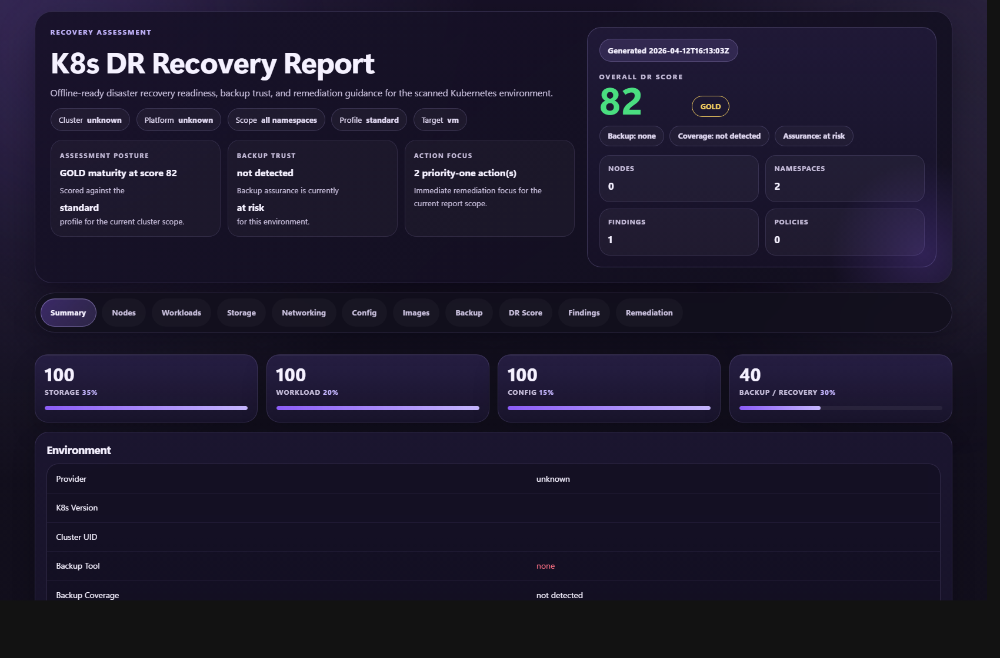
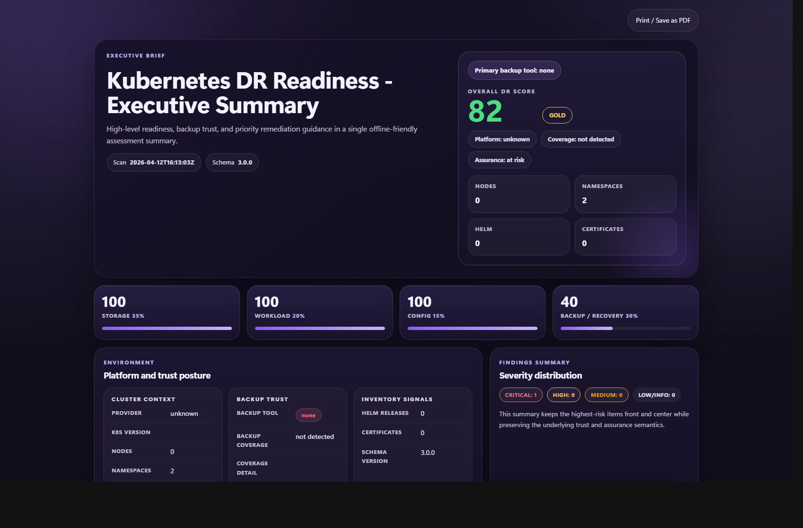
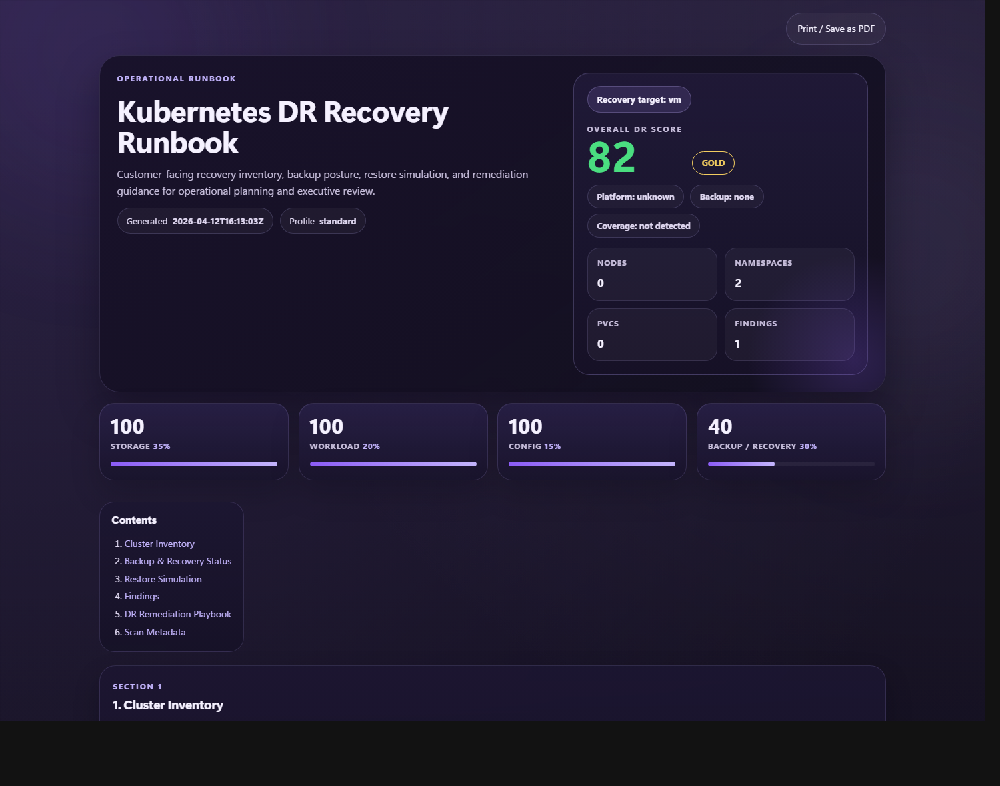

# k8s-recovery-visualizer

`k8s-recovery-visualizer` scans a Kubernetes cluster, scores disaster recovery readiness across weighted domains, and produces operator-friendly artifacts for audits, remediation planning, and CI/CD policy gates.

## Report screenshots

The generated HTML outputs are self-contained, offline-friendly, and designed for operator review, executive summaries, and customer-facing runbooks.

Main tabbed report:



Executive summary:



Customer-facing runbook:



The repo now prioritizes trust over optimism:

- backup detection is not treated as verified recoverability
- scoring is backed by golden rule scenarios instead of blob snapshots
- JSON output is versioned and schema-validated
- remediation output explains why a finding matters and how to verify and fix it

## What the tool does

- Inventories workloads, storage, networking, config, images, certificates, Helm metadata, backup evidence, and restore blockers.
- Produces weighted DR scores across `storage`, `workload`, `config`, and `backup / recovery`.
- Applies built-in scoring profiles: `standard`, `enterprise`, `dev`, `airgap`.
- Detects supported backup tools and distinguishes `detected`, `inferred`, `verified`, and `unverified` evidence.
- Generates:
  - `recovery-scan.json`
  - `recovery-enriched.json`
  - `recovery-report.html`
  - `recovery-report.md`
  - optional summary, runbook, CSV, and redacted artifacts
- Supports compare/trend policy gates for CI/CD.

## Trust model

Backup and restore conclusions are deliberately conservative.

Coverage states:

| Status | Meaning |
| --- | --- |
| `verified` | Policies or schedules were parsed and namespace coverage is known. |
| `unsupported` | A tool was detected but the scanner cannot inspect its policy objects yet. |
| `permission_denied` | The scanner knows how to inspect the tool but lacked permissions. |
| `api_error` | Policy inspection hit the API but failed. |
| `parse_error` | The API responded but the objects could not be parsed safely. |
| `not_detected` | No backup tool was detected. |

Assurance conclusions:

| Conclusion | Meaning |
| --- | --- |
| `evidence_confirmed` | Verified coverage, offsite posture, and restore prerequisites look strong for the currently covered scope. |
| `evidence_inferred` | Verified coverage exists, but recent success evidence is incomplete. |
| `coverage_gap` | A real recoverability gap or blocker was found. |
| `unverified` | Tooling exists but the scanner cannot verify scope safely. |
| `at_risk` | No usable backup evidence was found. |

`hasOffsite=true` now means every verified covered namespace has offsite or secondary-copy evidence. Partial offsite coverage is surfaced explicitly through `offsiteCoveredNamespaces`, `offsiteMissingNamespaces`, findings, and report text.

## Scoring model

Domain weights are loaded from [`internal/scoring/config/rule-pack.v1.json`](internal/scoring/config/rule-pack.v1.json). Profiles are loaded from [`internal/scoring/config/profiles.v1.json`](internal/scoring/config/profiles.v1.json).

Base weights:

| Domain | Weight |
| --- | --- |
| Storage | 35% |
| Workload | 20% |
| Config | 15% |
| Backup / Recovery | 30% |

Built-in profiles:

| Profile | Intent |
| --- | --- |
| `standard` | Baseline weighting |
| `enterprise` | Heavier restore, immutability, replication, and security penalties |
| `dev` | Slightly relaxed replication / immutability emphasis |
| `airgap` | Stronger penalties for external image dependency and immutability gaps |

Golden scenario tests live under [`internal/analyze/testdata/golden`](internal/analyze/testdata/golden) and validate exact triggered rules, domain deltas, overall score, maturity, and profile effects.

## Backup capability matrix

| Tool | Detection | Policy inspection | Recent success evidence | Offsite evidence |
| --- | --- | --- | --- | --- |
| Velero | Yes | Yes | Yes | Yes |
| Kasten K10 | Yes | Yes | Partial / inferred | Yes |
| Longhorn | Yes | Yes | Partial / inferred | Yes |
| Rubrik | Yes | Detection only | No | No |
| Trilio | Yes | Detection only | No | No |
| Stash | Yes | Detection only | No | No |
| CloudCasa | Yes | Detection only | No | No |

More detail: [`docs/CAPABILITY-MATRIX.md`](docs/CAPABILITY-MATRIX.md)

## Build

Prerequisites:

- Go `1.25+`, or a release binary from [GitHub Releases](https://github.com/eblackrps/k8s-recovery-visualizer/releases)
- Kubernetes credentials with the RBAC you intend to use

Host build:

```bash
make build
```

Cross-platform release binaries:

```bash
make release
```

Container image build:

```bash
docker build -t k8vis .
```

## Run

Cluster-wide scan:

```bash
./dist/scan-linux-amd64 --out ./out
./dist/scan-linux-amd64 --profile=enterprise --out ./out
./dist/scan-linux-amd64 --summary --runbook --redact --out ./out
```

Namespace-scoped scan:

```bash
./dist/scan-linux-amd64 --namespace=prod --out ./out
./dist/scan-linux-amd64 --namespace=prod,staging --out ./out
```

Dry run:

```bash
./dist/scan-linux-amd64 --dry-run --out ./out --min-score 0
```

Compare against a previous bundle:

```bash
./dist/scan-linux-amd64 --compare ./previous/recovery-scan.json --out ./out
```

## Policy gates for CI/CD

Use [`cmd/check`](cmd/check) against current and previous `recovery-scan.json` bundles.

Examples:

```bash
go run ./cmd/check --current ./out/recovery-scan.json --min-score 85 --format json
go run ./cmd/check --current ./out/recovery-scan.json --previous ./previous/recovery-scan.json --max-drop 5 --fail-on-new-critical
go run ./cmd/check --current ./out/recovery-scan.json --previous ./previous/recovery-scan.json --fail-on-offsite-loss --fail-on-uncovered-stateful --fail-on-missing-backup-policies
```

Legacy enriched-artifact checks still work:

```bash
go run ./cmd/check --in ./out/recovery-enriched.json --max-risk MODERATE --max-drop 5
```

## RBAC

Published manifests:

- Cluster-wide scan: [`deploy/rbac/cluster-scan.yaml`](deploy/rbac/cluster-scan.yaml)
- Namespace-scoped scan: [`deploy/rbac/namespace-scan.yaml`](deploy/rbac/namespace-scan.yaml)

RBAC guidance and degraded-mode behavior: [`docs/RBAC.md`](docs/RBAC.md)

Secret metadata collection is opt-in. The default manifests intentionally do not grant Secret read access. If you want `inventory.secrets`, run with `--include-secret-metadata` and explicitly extend RBAC after accepting that Kubernetes Secret reads expose full Secret objects to the scanner.

## JSON contracts

Current published schemas:

- Scan bundle: [`schemas/recovery-scan-3.0.0.schema.json`](schemas/recovery-scan-3.0.0.schema.json)
- Enriched bundle: [`schemas/recovery-enriched-1.1.0.schema.json`](schemas/recovery-enriched-1.1.0.schema.json)

Committed examples:

- [`schemas/examples/recovery-scan-3.0.0.sample.json`](schemas/examples/recovery-scan-3.0.0.sample.json)
- [`schemas/examples/recovery-scan-3.0.0.unverified.sample.json`](schemas/examples/recovery-scan-3.0.0.unverified.sample.json)
- [`schemas/examples/recovery-enriched-1.1.0.sample.json`](schemas/examples/recovery-enriched-1.1.0.sample.json)

Compatibility policy:

- additive fields require a schema minor version bump
- removals, renames, or new required fields require a major version bump
- CI validates emitted artifacts and committed samples against the published schemas

Schema docs: [`docs/SCHEMAS.md`](docs/SCHEMAS.md)

## Release process

Tags matching `v*` trigger [`.github/workflows/release.yml`](.github/workflows/release.yml).

Release outputs now include:

- versioned binaries
- SHA-256 checksums
- SPDX SBOM
- generated GitHub release notes
- GHCR container image with Buildx provenance and SBOM metadata

## Documentation

- Architecture: [`docs/ARCHITECTURE.md`](docs/ARCHITECTURE.md)
- RBAC: [`docs/RBAC.md`](docs/RBAC.md)
- Security: [`SECURITY.md`](SECURITY.md)
- Support matrix: [`docs/SUPPORT-MATRIX.md`](docs/SUPPORT-MATRIX.md)
- Capability matrix: [`docs/CAPABILITY-MATRIX.md`](docs/CAPABILITY-MATRIX.md)
- Schemas: [`docs/SCHEMAS.md`](docs/SCHEMAS.md)
- Troubleshooting: [`docs/TROUBLESHOOTING.md`](docs/TROUBLESHOOTING.md)

## Repository notes

- The supported implementation is the Go CLI in [`cmd/scan`](cmd/scan).
- The original PowerShell workflow is archived under [`legacy/powershell`](legacy/powershell).
- The scan pipeline orchestration now lives under [`internal/scanapp`](internal/scanapp).

## Known limitations

- Detection-only backup products remain inventory signals, not proof of recoverability.
- Namespace-scoped scans are useful but intentionally less complete than cluster-wide scans.
- A passing score is still not a substitute for a real restore drill with workload owners.
