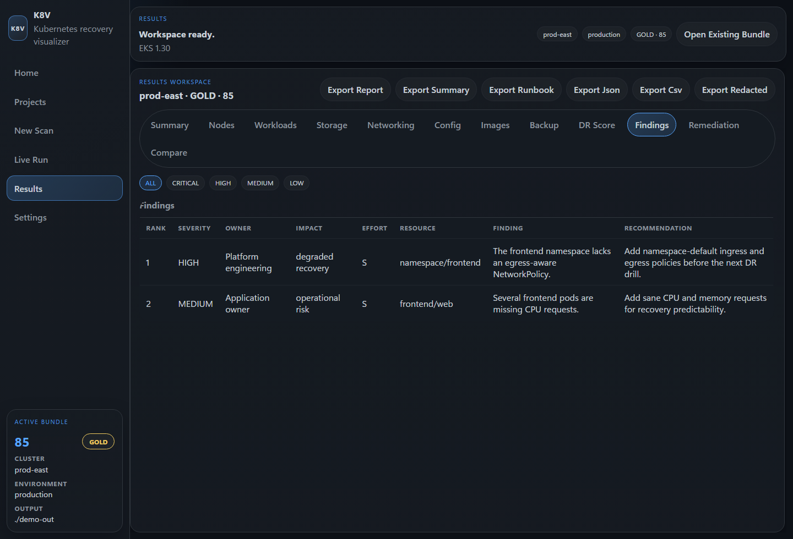
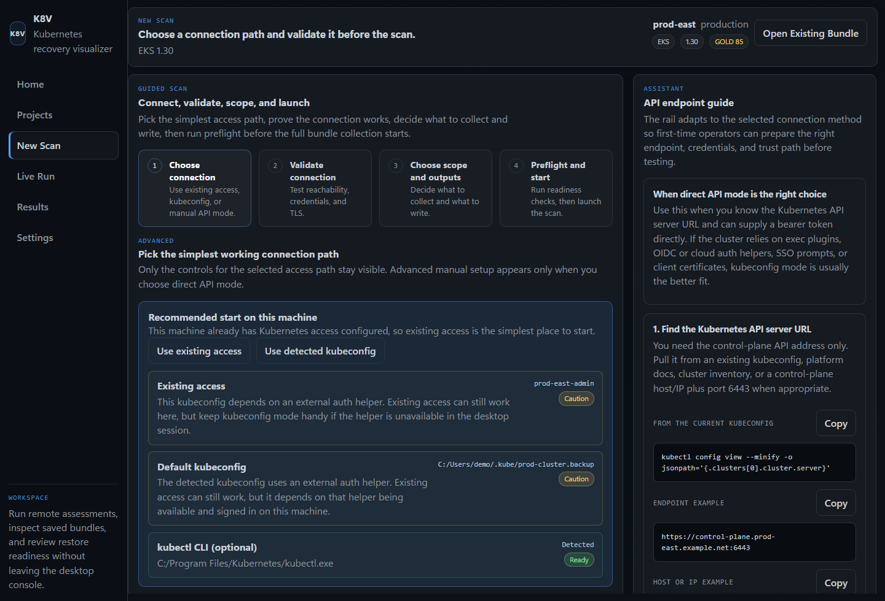
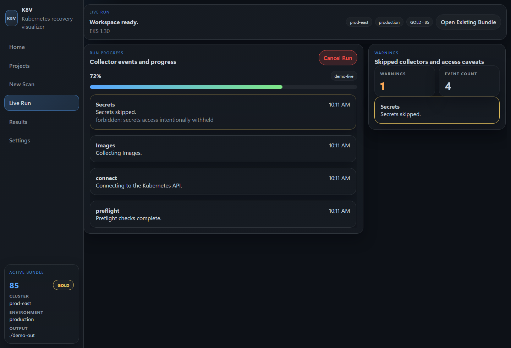
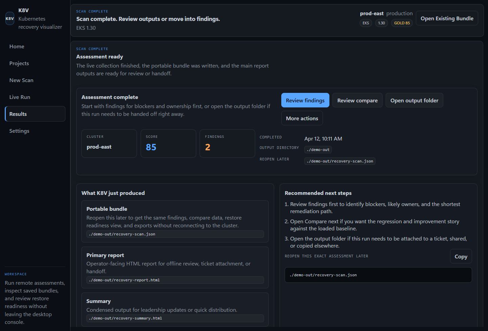
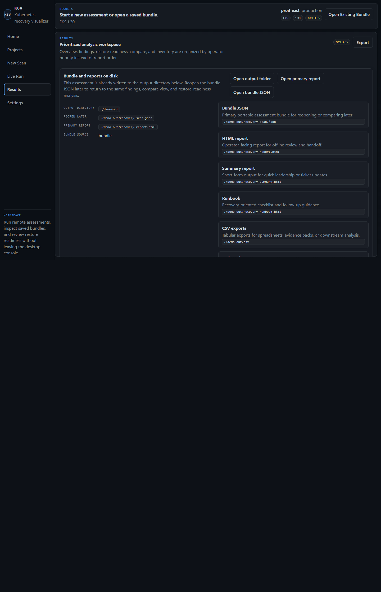

# k8s-recovery-visualizer

[](https://github.com/eblackrps/k8s-recovery-visualizer/actions/workflows/ci.yml)
[](https://github.com/eblackrps/k8s-recovery-visualizer/releases)
[](LICENSE)
[](go.mod)

`k8s-recovery-visualizer` is the repository, release, and archive identity for a Kubernetes disaster recovery assessment toolkit. The desktop product is `K8V`: a Wails desktop workspace for remote cluster scans, live preflight and run feedback, bundle review, history, compare workflows, and offline exports. The current desktop release is intentionally calmer and denser than earlier dashboard-styled builds, with a quieter shell, a simpler scan-complete handoff, and kubeconfig inspection that now calls out loopback-only cluster endpoints such as `127.0.0.1` instead of leaving operators to guess. The Go CLI stays in-repo for contributors, CI gates, smoke tests, automation, and source builds.

<!-- TODO: refresh screenshot for v1.10.2 -->
- Home view placeholder: first-run onboarding, machine readiness, tighter enterprise surfaces, and the trimmed topbar now define the refreshed desktop entry point.

<p align="center">
  
</p>

`K8V` can scan a live cluster or open an existing bundle directory, `recovery-scan.json`, `.zip`, `.tar.gz`, or `.tgz` bundle without cluster access. Bundle loading now validates archives and JSON structure up front so operators get clearer corruption or mis-packaging diagnostics instead of a generic open failure.

## What Teams Get

- an operator-first desktop workspace that surfaces judgment, regressions, and restore readiness before inventory chrome
- prioritized findings with impact, likely owner, rough effort, and deterministic ranking
- restore-readiness evidence that goes beyond “backup detected” to show blocked, warning, ready, and unknown namespaces
- a restore drill planner that turns bundle evidence into an operator runbook sequence
- compare and history workflows that surface score drift, severity deltas, regressed findings, and persistent gaps
- offline-friendly exports and schema-validated bundles that still work in CI and air-gapped review flows

## Public Release

Public GitHub releases publish exactly four files:

- `k8s-recovery-visualizer-desktop-linux-amd64.tar.gz`
- `k8s-recovery-visualizer-desktop-windows-amd64.zip`
- `checksums.txt`
- `k8s-recovery-visualizer.spdx.json`

Current supported public release platforms:

| Platform | Status | Notes |
| --- | --- | --- |
| Linux desktop amd64 | Supported | Public tarball release artifact |
| Windows desktop amd64 | Supported | Public zip release artifact |

Deprecated release surfaces and contributor-only build paths are documented in [docs/SUPPORT-MATRIX.md](docs/SUPPORT-MATRIX.md).

## Support Limits

- Public GitHub releases support Linux amd64 and Windows amd64 desktop packages only.
- Public macOS desktop packages, prebuilt CLI release binaries, and GHCR container images are deprecated in this release line.
- The CLI remains fully supported through source builds, CI gates, automation, smoke tests, and contributor workflows.

## Start Here

| Path | Best for | How |
| --- | --- | --- |
| Use the supported desktop release | Operators, consultants, and evaluators | Download the Linux or Windows desktop package from [GitHub Releases](https://github.com/eblackrps/k8s-recovery-visualizer/releases/latest) and launch `K8V` |
| Build the CLI from source | Contributors, CI, air-gapped workflows | `make build` |
| Build cross-platform CLI binaries locally | Contributor validation and internal packaging | `make build-cli-cross` |
| Run the desktop app in dev mode | Frontend and UX iteration | `make frontend-install && make dev-gui` |
| Build the current-host desktop app | Local packaging validation | `make frontend-install && make build-gui` |

## Quickstart

### Desktop Release Quickstart

1. Download the Linux tarball or Windows zip from [GitHub Releases](https://github.com/eblackrps/k8s-recovery-visualizer/releases/latest).
2. Extract the archive.
3. Launch `K8V` directly. On Windows, the zip also includes `K8V-amd64-installer.exe` if you prefer an installed shortcut.
4. Choose **New Scan** for a live assessment or **Open Existing Bundle** for offline review.
5. In **New Scan**, follow the guided four-step flow:
   choose a connection, test it, choose scope and outputs, then run preflight before launch.
   The Home view and Step 1 now include a machine-readiness summary so you can see whether current login, a default kubeconfig, or only manual access paths are actually available on that machine.
   Profile, recovery target, timeout, and compare baseline stay visible in the scope step; customer, site, and enterprise metadata toggles stay tucked into the **Enterprise metadata** accordion.
6. Start with **Use existing access** when `kubectl` or the default kubeconfig already reaches the cluster from that machine.
7. Use **Load kubeconfig file** or **Paste kubeconfig** when operators hand you kubeconfig access. `K8V` validates kubeconfig content, so files like `prod-cluster.backup`, `config`, or extensionless names are all accepted if the contents are valid.
   If the desktop inspector flags missing local CA or client-certificate files, the kubeconfig YAML copied over but the supporting files did not. Bring those files too or export a self-contained kubeconfig with embedded `*-data` fields.
   If the kubeconfig points at `127.0.0.1`, `localhost`, or another loopback API server, the file is valid but only usable from the machine, jumpbox, or tunnel path that created it. Replace the server with the reachable control-plane DNS/IP for the desktop you are using, or export a kubeconfig that already contains the real endpoint.
   If the native picker is awkward, you can also drag a kubeconfig onto the in-app dropzone and K8V will load it into paste mode automatically.
8. Use **API endpoint** only for direct endpoint, bearer-token, and TLS setup. The in-app assistant now walks through endpoint discovery, short-lived token creation, trust choices, and when kubeconfig mode is the better fit.
9. A successful scan writes a portable bundle plus optional summary, runbook, CSV, and redacted outputs to the chosen output directory. You can reopen that bundle later without cluster access.
   The Results workspace also keeps the output directory, bundle path, and primary report path visible so first-time operators know exactly what was generated and where it landed.
   After a live run finishes, K8V now shows a quieter scan-complete handoff with the primary next steps visible first and secondary file actions grouped under `More actions`.
   That completion step appears before the operator has to navigate results tabs, so the “what happened” and “what do I do next” answers are explicit.

#### Keyboard shortcuts

- `Ctrl+N` opens **New Scan**.
- `Ctrl+O` opens **Open Existing Bundle**.
- `Ctrl+H` returns to **Home**.

### Desktop Development Quickstart

Install frontend dependencies and launch the desktop app in development mode:

```bash
make frontend-install
make dev-gui
```

Build the current-host desktop app:

```bash
make frontend-install
make build-gui
```

### CLI Source Builds

Run a deterministic dry run:

```bash
go run ./cmd/scan --dry-run --summary --runbook --out ./out --min-score 0
```

Run a live scan with a named context and profile:

```bash
go run ./cmd/scan --context prod-east-admin --profile enterprise --summary --runbook --out ./out
```

Evaluate the generated bundle in CI:

```bash
go run ./cmd/check --current ./out/recovery-scan.json --min-score 85 --min-backup-score 80 --max-new-findings 0 --max-regressed-findings 0 --format json
```

Build a host-specific CLI binary into `dist/`:

```bash
make build
```

## Latest Desktop Screenshots

<!-- TODO: refresh screenshot for v1.10.2 -->
- Home view placeholder: onboarding cards appear only on the first run, while returning operators see the tighter four-panel workspace without repeated explainer content.

<p align="center">
  
  
</p>
<p align="center">
  
  
  
</p>

The public gallery intentionally uses the current deterministic desktop screenshot set only. See [docs/SCREENSHOTS.md](docs/SCREENSHOTS.md) for the capture workflow and maintained image list.
The current gallery reflects the guided, operator-grade desktop UX shipped in `v1.10.2`.

## CLI And Desktop At A Glance

| Surface | Best for | Strengths |
| --- | --- | --- |
| CLI (`cmd/scan`, `cmd/check`) | CI/CD, repeatable ops workflows, scripting, source builds | Stable flags, schema-validated bundles, policy gating, deterministic smoke flows |
| Desktop (`desktop/`) | Remote cluster scans, bundle review, compare/history exploration | Shared backend, preflight assistant, live progress, cancellation, export controls, prioritized findings, restore drill planning, offline bundle inspection |

## Output Artifacts

`K8V` is built around a simple mental model:

- connection setup tells the app how to reach the cluster
- a scan writes a portable bundle and reports into an output directory
- opening an existing bundle reuses those saved outputs for offline review, compare, and export refreshes

The guided scan flow makes `connection test`, `preflight`, and `scan` distinct on purpose:

- `Test connection` answers whether transport, auth, and TLS work
- `Preflight` answers whether RBAC, scope, and collectors are ready
- `Start scan` collects evidence and writes the bundle/report artifacts

When one of those steps fails, `K8V` now classifies the failure into an operator-facing bucket such as `Endpoint unreachable`, `TLS trust`, `External auth helper`, `RBAC denied`, or `Output path`. The UI keeps the raw detail available, but the first thing operators see is the next step instead of a generic `failed` state.

| Artifact | Purpose |
| --- | --- |
| `recovery-scan.json` | Primary machine-readable DR bundle |
| `recovery-enriched.json` | Enriched bundle used for history, compare, and follow-on tooling |
| `recovery-report.html` | Offline tabbed HTML report |
| `recovery-report.md` | Markdown export of the report |
| `recovery-summary.html` | Optional executive summary |
| `recovery-runbook.html` | Optional customer-facing DR runbook |
| `csv/` | Optional CSV exports for spreadsheet or downstream analysis |
| `*-redacted.*` | Optional share-safe exports with masked identifiers |

## Compare, History, And Policy Gates

- Open a bundle in `K8V` or run `cmd/scan --compare ./previous/recovery-scan.json` to review score drift, severity deltas, persistent gaps, and regressed findings.
- Historical bundles add per-domain trend points so repeat assessments can show whether recovery readiness is improving or backsliding over time.
- Use `cmd/check` in CI to enforce overall score floors, domain-specific thresholds, new-finding budgets, regressed-finding budgets, and backup readiness gates against emitted bundles.

## Documentation

- Start here: [docs/README.md](docs/README.md)
- CLI usage and source builds: [docs/CLI.md](docs/CLI.md)
- Desktop app guide: [docs/GUI.md](docs/GUI.md)
- Architecture: [docs/ARCHITECTURE.md](docs/ARCHITECTURE.md)
- Development: [docs/DEVELOPMENT.md](docs/DEVELOPMENT.md)
- Release process: [docs/RELEASE.md](docs/RELEASE.md)
- Support policy: [docs/SUPPORT-MATRIX.md](docs/SUPPORT-MATRIX.md)
- Troubleshooting: [docs/TROUBLESHOOTING.md](docs/TROUBLESHOOTING.md)
- Schemas and compatibility: [docs/SCHEMAS.md](docs/SCHEMAS.md)
- Screenshots: [docs/SCREENSHOTS.md](docs/SCREENSHOTS.md)

## Community

- Contributing: [CONTRIBUTING.md](CONTRIBUTING.md)
- Privacy: [PRIVACY.md](PRIVACY.md)
- Support: [SUPPORT.md](SUPPORT.md)
- Security: [SECURITY.md](SECURITY.md)
- Code of Conduct: [CODE_OF_CONDUCT.md](CODE_OF_CONDUCT.md)
- License: [LICENSE](LICENSE)
