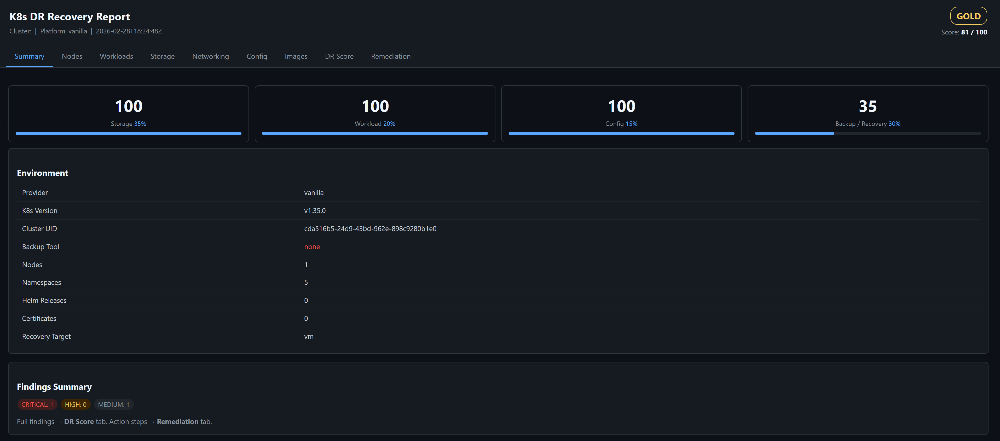
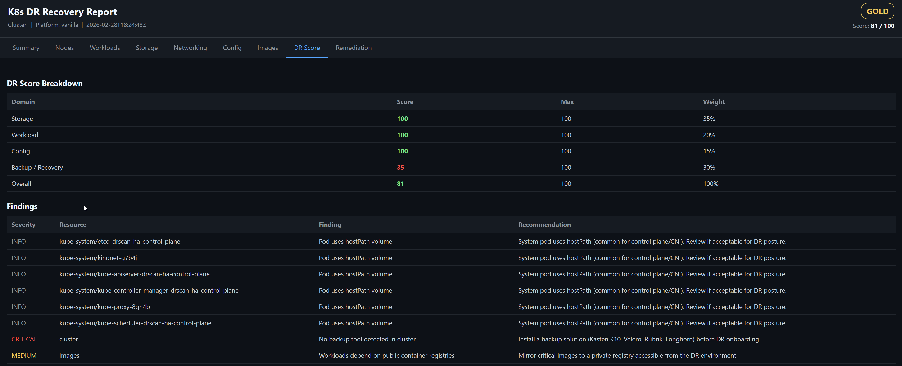
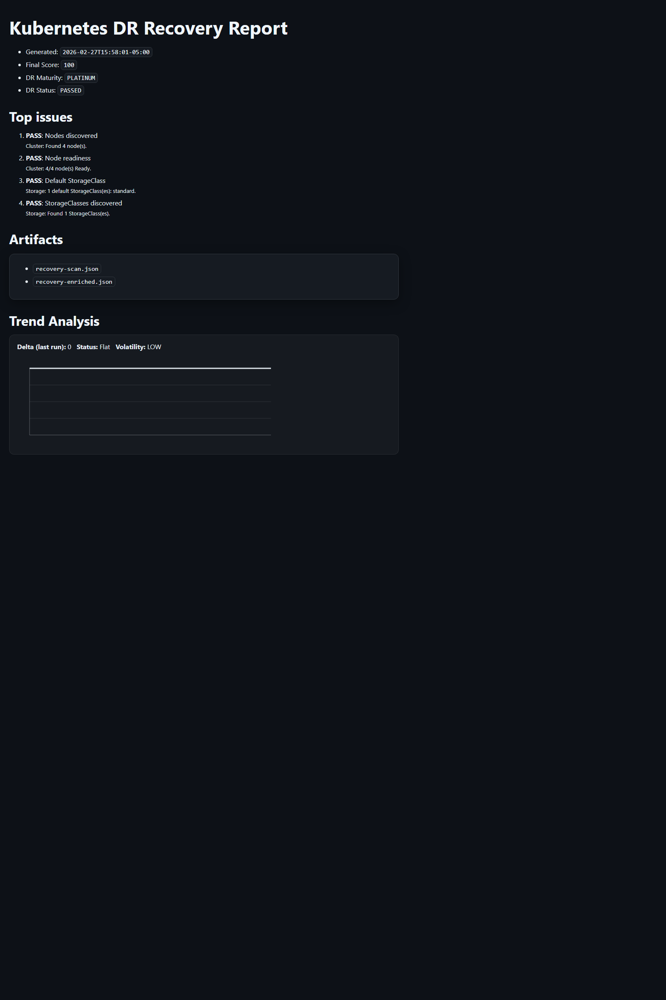
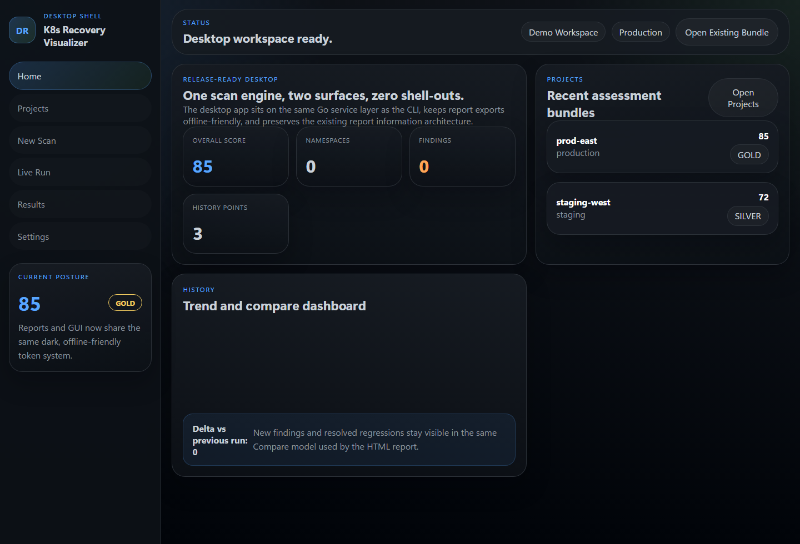
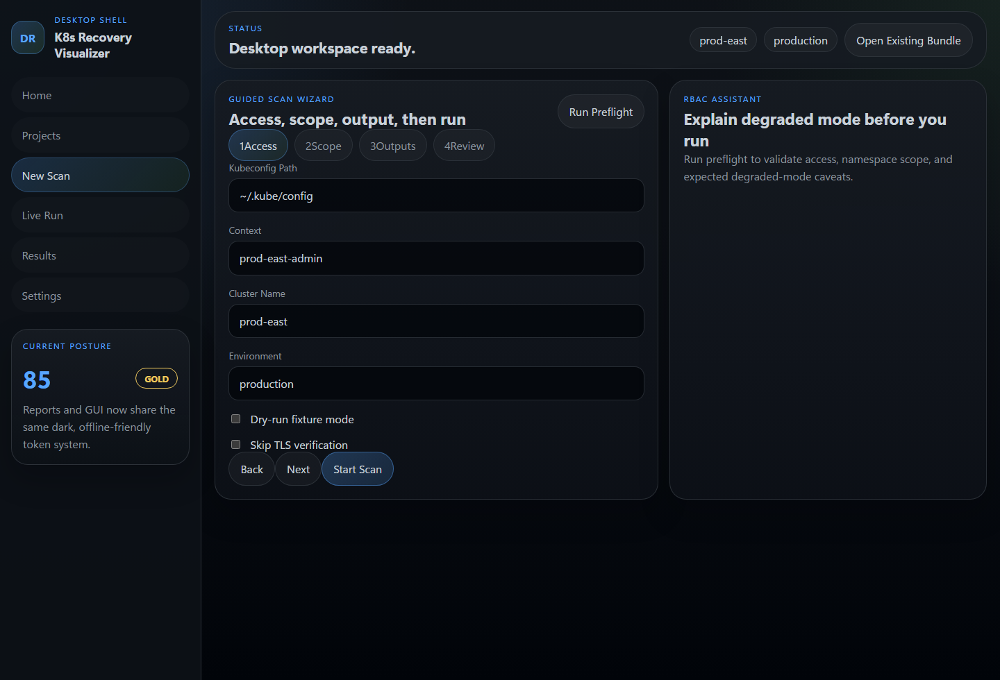

# k8s-recovery-visualizer

[](https://github.com/eblackrps/k8s-recovery-visualizer/actions/workflows/ci.yml)
[](https://github.com/eblackrps/k8s-recovery-visualizer/actions/workflows/release.yml)
[](https://github.com/eblackrps/k8s-recovery-visualizer/blob/main/go.mod)
[](https://github.com/eblackrps/k8s-recovery-visualizer/releases)

`k8s-recovery-visualizer` inventories a Kubernetes cluster, scores disaster recovery readiness across weighted domains, and produces offline-friendly artifacts for audits, remediation planning, compare/diff reviews, and CI/CD policy gates.

`v1.4.0` keeps the supported Go CLI intact while adding a production-oriented Wails desktop app powered by the same shared Go service layer and the same visual language as the generated reports.

## Screenshot Gallery

Report surfaces:





Desktop surfaces:





## What's New In v1.4.0

- Added a shared backend service layer in `internal/appcore` so the CLI and GUI execute the same scan, preflight, compare, export, and workspace-loading flow.
- Added a Wails v2 desktop app in `desktop/` with React + TypeScript screens for Home, Projects, New Scan, Live Run, Results, and Settings.
- Centralized report and desktop theme tokens in `internal/theme`, preserving the existing report palette and feel.
- Added a guided scan wizard, RBAC/preflight assistant, live progress events, structured warnings, cancel support, and an open-existing-bundle workflow.
- Added a results workspace that mirrors the report tabs: Summary, Nodes, Workloads, Storage, Networking, Config, Images, Backup, DR Score, Findings, Remediation, and Compare.
- Added deterministic frontend fixtures plus automated GUI screenshot generation for release docs.
- Expanded release readiness with changelog, contributing guide, GUI docs, screenshot docs, release notes guidance, Make targets, and stronger CI/release automation.

## CLI Quickstart

Prerequisites:

- Go `1.25+`
- Kubernetes credentials for the cluster or namespace scope you want to inspect

Build the CLI:

```bash
make build
```

Run a dry-run scan:

```bash
./dist/scan-linux-amd64 --dry-run --summary --runbook --out ./out --min-score 0
```

Run a live cluster-wide scan:

```bash
./dist/scan-linux-amd64 --profile enterprise --summary --runbook --out ./out
```

Run a namespace-scoped scan:

```bash
./dist/scan-linux-amd64 --namespace payments,frontend --context prod-east-admin --out ./out
```

Compare against a previous bundle:

```bash
./dist/scan-linux-amd64 --compare ./previous/recovery-scan.json --out ./out
```

## Desktop Quickstart

Install frontend dependencies:

```bash
make frontend-install
```

Run the desktop app in dev mode:

```bash
make dev-gui
```

Build the desktop app for the current host:

```bash
make build-gui
```

The desktop app uses the same shared Go backend as the CLI. It does not shell out to `cmd/scan` during normal runs.

## Desktop Workflow

- `Home / Projects`: recent output bundles discovered from the workspace root.
- `New Scan`: guided wizard for kubeconfig/context, namespace scope, profile, baseline compare path, output location, redaction, summary/runbook, CSV export, and dry-run.
- `Live Run`: progress, structured scan events, warning surfacing, and cancel support.
- `Results`: a tabbed workspace aligned to the offline HTML report model.
- `Settings`: workspace defaults plus a simple “Open existing bundle” path for inspecting prior scans without live cluster access.

More detail: [docs/GUI.md](docs/GUI.md)

## Generated Outputs

The scan pipeline writes:

- `recovery-scan.json`
- `recovery-enriched.json`
- `recovery-report.html`
- `recovery-report.md`
- optional summary, runbook, CSV, and redacted artifacts

All HTML outputs remain self-contained and offline-friendly.

## JSON Contracts

Published schemas remain unchanged in `v1.4.0`:

- Scan bundle: [`schemas/recovery-scan-3.0.0.schema.json`](schemas/recovery-scan-3.0.0.schema.json)
- Enriched bundle: [`schemas/recovery-enriched-1.1.0.schema.json`](schemas/recovery-enriched-1.1.0.schema.json)

Compatibility policy:

- additive fields require a schema minor version bump
- removals, renames, or new required fields require a schema major version bump
- CI validates emitted bundles and committed samples against the published schemas

More detail: [docs/SCHEMAS.md](docs/SCHEMAS.md)

## Trust Model

Backup and restore conclusions are intentionally conservative:

- backup detection is not treated as verified recoverability
- namespace-scoped scans are useful, but less complete than cluster-wide scans
- passing scores are not a substitute for real restore drills with workload owners

RBAC and degraded-mode behavior: [docs/RBAC.md](docs/RBAC.md)

## Build, Test, And Validation

Common targets:

- `make fmt`
- `make vet`
- `make test`
- `make frontend-build`
- `make frontend-test`
- `make screenshots`
- `make smoke`
- `make schema-samples`
- `make docs-check`
- `make ci`

Release packaging guidance: [docs/RELEASE.md](docs/RELEASE.md)

## Documentation

- Architecture: [docs/ARCHITECTURE.md](docs/ARCHITECTURE.md)
- Desktop app: [docs/GUI.md](docs/GUI.md)
- Screenshot generation: [docs/SCREENSHOTS.md](docs/SCREENSHOTS.md)
- Release workflow: [docs/RELEASE.md](docs/RELEASE.md)
- Capability matrix: [docs/CAPABILITY-MATRIX.md](docs/CAPABILITY-MATRIX.md)
- RBAC: [docs/RBAC.md](docs/RBAC.md)
- Schemas: [docs/SCHEMAS.md](docs/SCHEMAS.md)
- Support matrix: [docs/SUPPORT-MATRIX.md](docs/SUPPORT-MATRIX.md)
- Troubleshooting: [docs/TROUBLESHOOTING.md](docs/TROUBLESHOOTING.md)
- Security: [SECURITY.md](SECURITY.md)
- Contributing: [CONTRIBUTING.md](CONTRIBUTING.md)
- Changelog: [CHANGELOG.md](CHANGELOG.md)

## Repository Notes

- The supported CLI implementation remains [`cmd/scan`](cmd/scan).
- The scan entrypoint stays intentionally thin and routes through [`internal/scanapp`](internal/scanapp).
- Shared application logic for both CLI and desktop now lives in [`internal/appcore`](internal/appcore).
- Shared design tokens for reports and the desktop UI now live in [`internal/theme`](internal/theme).
- The legacy HTML writer in [`internal/output/html.go`](internal/output/html.go) is retained for compatibility and now consumes the shared theme.
- The original PowerShell workflow remains archived in [`legacy/powershell`](legacy/powershell).
